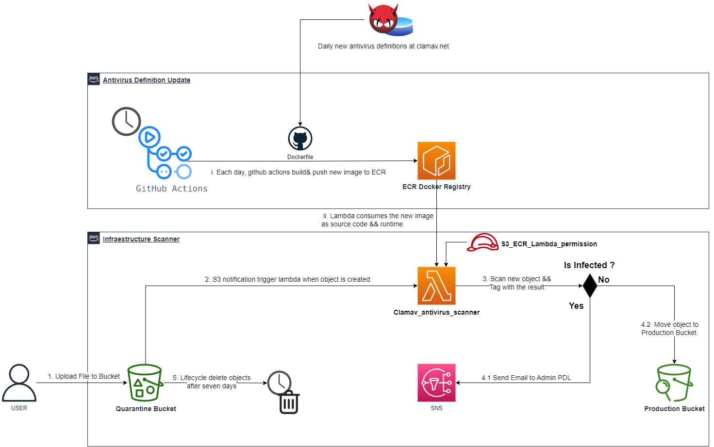

# ClamAV_Antivirus_Scanner_Terragrunt-Infrastructure-Live

This repository contains Terraform and Terragrunt Infraestructure as code to create the resources for the S3 scanner malware architecture in AWS Cloud. 



## Architecture Overview

1. A user uploads a file to the S3 bucket of quarantine.
2. S3 triggers a notification, which in turn triggers a Lambda function.
3. The Lambda function downloads the file and scans it using the clamav engine.
4. If the file is infected, the Lambda function sends an email using an SNS topic to notify an administrator that the file is infected and needs to be dealt with.
5. If the file is clean, the Lambda function moves the file to the production bucket for use in the production environment.

Here are the resources that will be created:

- An ECR repository to upload the Lambda function image code. 
- An IAM role to grant permissions to the Lambda function to get the image from ECR, get objects from the quarantine bucket, and move them to the production bucket. It uses a custom module. [am_lambda_role]
- A Lambda function with the above role attached.
- Two S3 buckets: one for quarantine and one for production.It uses a custom module. [s3_with_notifications]
- An SNS topic to send email notifications to specific email addresses. It uses a custom module. [sns_email_to_admins]


## How do you deploy the infrastructure in this repo?


### Pre-requisites

1. Install [Terraform](https://www.terraform.io/) version `1.1.4` and
   [Terragrunt](https://github.com/gruntwork-io/terragrunt) version `v0.36.0` or newer.
1. Update the `bucket` parameter in the root `terragrunt.hcl`. We use S3 [as a Terraform
   backend](https://www.terraform.io/docs/backends/types/s3.html) to store your
   Terraform state, and S3 bucket names must be globally unique. The name currently in
   the file is already taken, so you'll have to specify your own. Alternatives, you can
   set the environment variable `TG_BUCKET_PREFIX` to set a custom prefix.
1. Configure your AWS credentials using one of the supported [authentication
   mechanisms](https://www.terraform.io/docs/providers/aws/#authentication).
1. Fill in your AWS Account ID's in `non-prod/account.hcl`.

## Modules

Due to the special requirements the following modules had to be created:

```
├── modules
│   ├── iam_lambda_role
│   ├── s3_with_notifications
│   └── sns_email_to_admins
```


### Deploying a single module

1. `cd` into the module's folder (e.g. `cd non-prod/us-east-1/ECR`).
1. Run `terragrunt plan` to see the changes you're about to apply.
1. If the plan looks good, run `terragrunt apply`.


### Deploying all modules in a region

1. `cd` into the region folder (e.g. `cd non-prod/us-east-1`).
1. Run `terragrunt plan-all` to see all the changes you're about to apply.
1. If the plan looks good, run `terragrunt apply-all`.


## How is the code in this repo organized?

The code in this repo uses the following folder hierarchy:

```
account
 └ _global
 └ region
    └ _global
    └ environment
       └ resource
```

Where:

* **Account**: At the top level are each of your AWS accounts, such as `stage-account`, `prod-account`, `mgmt-account`,
  etc. If you have everything deployed in a single AWS account, there will just be a single folder at the root (e.g.
  `main-account`).

* **Region**: Within each account, there will be one or more [AWS
  regions](http://docs.aws.amazon.com/AWSEC2/latest/UserGuide/using-regions-availability-zones.html), such as
  `us-east-1`, `eu-west-1`, and `ap-southeast-2`, where you've deployed resources. There may also be a `_global`
  folder that defines resources that are available across all the AWS regions in this account, such as IAM users,
  Route 53 hosted zones, and CloudTrail.

* **Environment**: Within each region, there will be one or more "environments", such as `qa`, `stage`, etc. Typically,
  an environment will correspond to a single [AWS Virtual Private Cloud (VPC)](https://aws.amazon.com/vpc/), which
  isolates that environment from everything else in that AWS account. There may also be a `_global` folder
  that defines resources that are available across all the environments in this AWS region, such as Route 53 A records,
  SNS topics, and ECR repos.

* **Resource**: Within each environment, you deploy all the resources for that environment, such as EC2 Instances, Auto
  Scaling Groups, ECS Clusters, Databases, Load Balancers, and so on. Note that the Terraform code for most of these
  resources lives in the [terragrunt-infrastructure-modules-example repo](https://github.com/gruntwork-io/terragrunt-infrastructure-modules-example).


## RESOURCES - DRY CODE WITH TERRAGRUNT 

This repo, along with the [terragrunt-infrastructure-modules-examplerepo](https://github.com/gruntwork-io/terragrunt-infrastructure-modules-example), show an example file/folder structure you can use with [Terragrunt](https://github.com/gruntwork-io/terragrunt) to keep your [Terraform](https://www.terraform.io) code DRY. For background information, check out the [Keep your Terraform code DRY](https://github.com/gruntwork-io/terragrunt#keep-your-terraform-code-dry) section of the Terragrunt documentation.

Be sure to read through [the Terragrunt documentation on DRY Architectures](https://terragrunt.gruntwork.io/docs/features/keep-your-terragrunt-architecture-dry/) to understand the features of Terragrunt used in this folder organization.

Note: This code is solely for demonstration purposes. This is not production-ready code, so use at your own risk. If
you are interested in battle-tested, production-ready Terraform code, check out [Gruntwork](http://www.gruntwork.io/).
